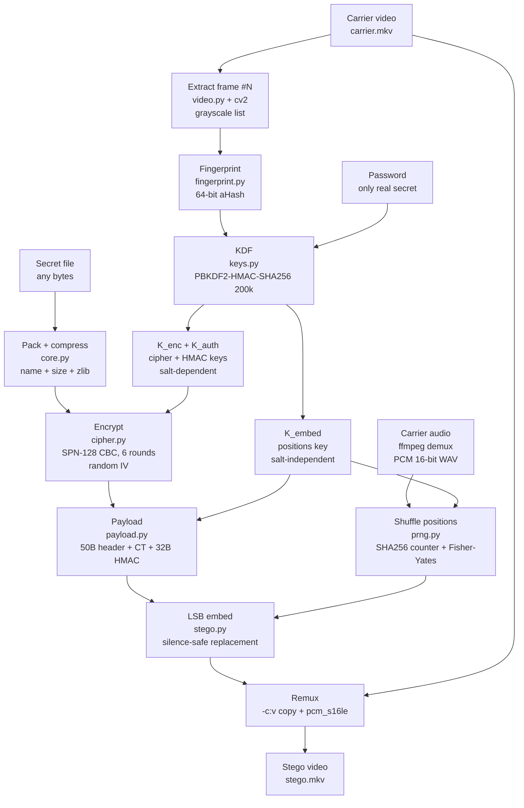
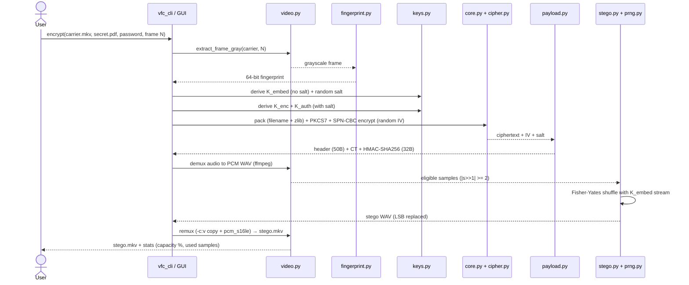
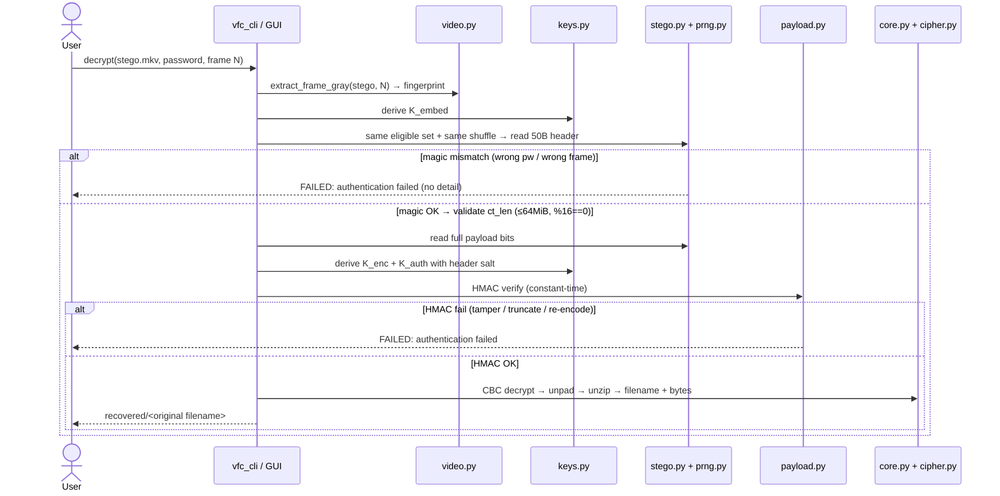
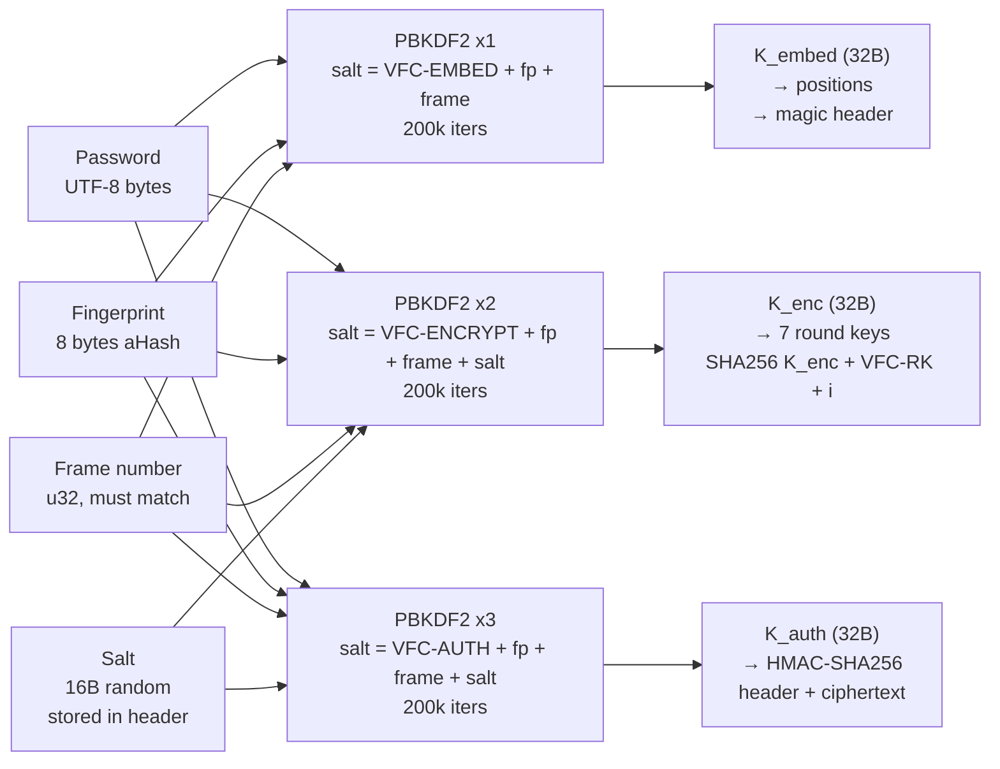
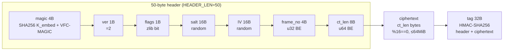
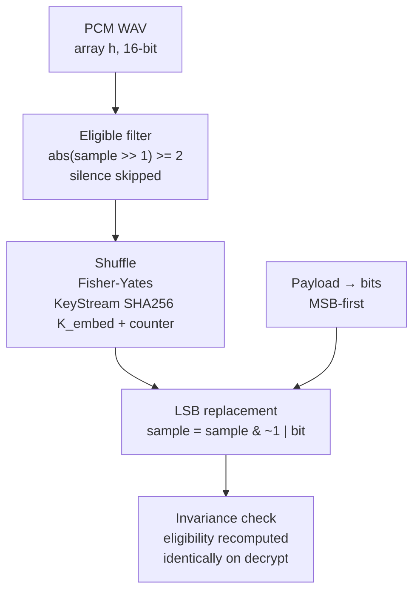
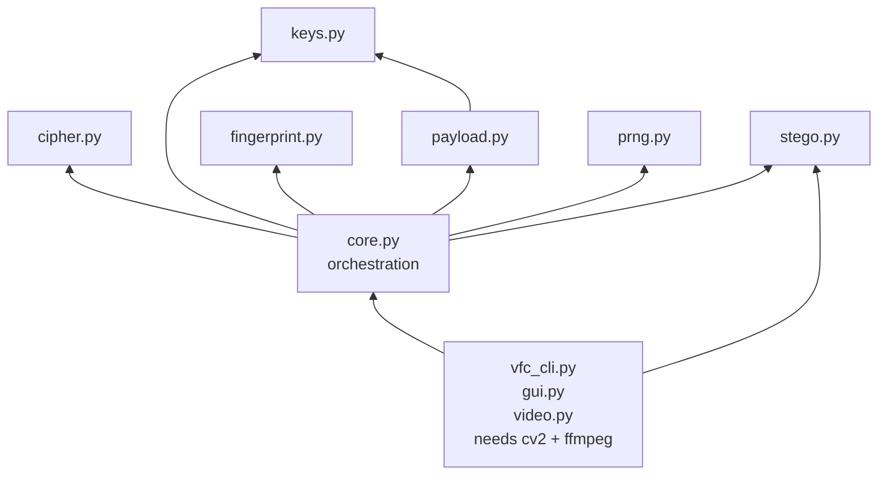

# VFC — Video Frame Cipher

Educational Python system that hides an encrypted file inside a video's audio track, with encryption keys bound to a chosen video frame + password.

Core idea: **frame fingerprint → key derivation → custom SPN encryption → authenticated payload → audio LSB steganography → stego video**. Decryption reverses the chain and fails closed on wrong password, wrong frame, or tampered audio.

> **Status:** educational / experimental (v0.2). Custom cryptographic construction. **Not production cryptography. Not a replacement for AES / ChaCha20-Poly1305. See [Security Model](#security-model) and [Security Disclaimer](#security-disclaimer).**

---

## Table of Contents

- [Overview](#overview)
- [Why VFC?](#why-vfc)
- [Core Concept](#core-concept)
- [How It Works](#how-it-works)
- [System Diagrams](#system-diagrams)
- [شرح شامل بالعربية](#شرح-شامل-بالعربية)
- [Architecture](#architecture)
- [Security Model](#security-model)
- [Features](#features)
- [Project Structure](#project-structure)
- [Installation](#installation)
- [Usage](#usage)
- [Environment Variables](#environment-variables)
- [Supported Formats](#supported-formats)
- [Example Workflow](#example-workflow)
- [Academic Kit](#academic-kit)
- [Security Disclaimer](#security-disclaimer)
- [Limitations](#limitations)
- [Roadmap](#roadmap)
- [Development](#development)
- [Testing](#testing)
- [Contributing](#contributing)
- [License](#license)

---

## Overview

VFC demonstrates how several security primitives compose into one end-to-end system:

1. **Video processing** — extract one frame for key binding; demux/remux audio without touching video bytes.
2. **Frame fingerprinting** — compact 64-bit aHash of the chosen frame.
3. **Key derivation** — PBKDF2-HMAC-SHA256 separates embedding, encryption, and authentication keys.
4. **Encryption** — custom 128-bit SPN block cipher in CBC mode with PKCS#7 padding.
5. **Payload construction** — versioned header + ciphertext + HMAC-SHA256 (Encrypt-then-MAC).
6. **Steganography** — silence-aware LSB replacement in 16-bit PCM audio at CSPRNG-shuffled positions.
7. **Interfaces** — CLI (`vfc/vfc_cli.py`), desktop GUI (`vfc/gui.py` via `vfc_gui.py`), and an interactive web lab (`academic-kit/`).

The stdlib-only core (`core.py` + `cipher.py` + `keys.py` + `fingerprint.py` + `payload.py` + `prng.py` + `stego.py`) works on in-memory frame arrays and WAV samples. `video.py` adds the real video wrapper (OpenCV + ffmpeg).

---

## Why VFC?

Most tutorials teach encryption *or* steganography in isolation. VFC teaches **composition**:

- How a password alone is insufficient without domain separation and salt handling.
- Why authentication must happen *before* decryption (Encrypt-then-MAC).
- Why steganographic capacity, eligibility, and determinism matter as much as the cipher.
- How a carrier-bound value (frame hash) can diversify keys without being a secret.
- How small design choices (salt circular dependency, LSB invariance, header validation order) decide whether a system fails open or closed.

If you are a student, instructor, or reviewer, `academic-kit/` lets you inspect every byte of a real trace generated from the actual Python implementation — no simulated cipher states.

---

## Core Concept

```
Password (only real secret)
  + Frame fingerprint (64-bit aHash, public, carrier-bound)
  + Frame number (public, must match exactly)
  + Random salt (16 bytes, public, stored in payload)
    ── PBKDF2-HMAC-SHA256 (200,000 iterations) ──>
      K_embed (positions) | K_enc (cipher) | K_auth (HMAC)
```

- `K_embed` is **salt-independent** so decryption can locate the payload before reading the salt. Documented trade-off, not an oversight (see `vfc/keys.py`).
- `K_enc` / `K_auth` are **salt-dependent**.
- The frame fingerprint **binds keys to the carrier** but is **not secret** — anyone with the video and frame number can recompute it.

---

## How It Works

### Encrypt (hide)

```text
Input video (e.g. carrier.mkv)
   │  extract frame #N → grayscale → 64-bit fingerprint (fingerprint.py)
   ▼
Password + fingerprint + frame_no ──PBKDF2──> K_embed, K_enc (+salt), K_auth (+salt)
   │  K_enc → 7 round keys via SHA256(K_enc || "VFC-RK" || i)[:16]
   ▼
Secret file → [name_len||name||orig_size||flags||data] → zlib (iff smaller) → PKCS#7 → SPN-CBC encrypt (cipher.py, IV random 16B)
   ▼
Header(magic||ver||flags||salt||IV||frame_no||ct_len) + ciphertext + HMAC-SHA256(header||ciphertext)  (payload.py)
   │  magic = SHA256(K_embed || "VFC-MAGIC")[:4]
   ▼
Carrier audio → demux to PCM WAV (ffmpeg) → eligible samples (|s>>1|>=2) → Fisher-Yates shuffle via SHA256(K_embed||counter) (prng.py)
   → LSB replacement (stego.py) → remux with -c:v copy + pcm_s16le → stego.mkv (video.py)
```

### Decrypt (recover)

```text
Stego video
   │  extract frame #N → fingerprint → K_embed
   ▼
Eligible samples → same shuffled positions → read 50-byte header → magic check (constant-time)
   → validate ct_len (≤64 MiB, %16==0) → read full payload → HMAC verify (constant-time)
   → derive K_enc/K_auth with header salt → SPN-CBC decrypt → unpad → unzip → filename + bytes
   ▼
Recovered file written to <out_dir>/<original filename>
```

Any failure — wrong password, wrong frame, truncated payload, single-bit flip, re-encoded audio — raises `ValueError("authentication failed" / ...)` and aborts **before** writing output.

---

## System Diagrams

> All diagrams below describe the **actual v0.2 implementation** (not a proposal). They render natively on GitHub (Mermaid). Source of truth remains `vfc/*.py`.

### 1) End-to-end overview



**How to read it:** video goes in two directions at once — frame `#N` goes **up** into key derivation (binding), audio goes **right** into the stego carrier (hiding). Password is the only secret; everything else (frame, fingerprint, salt, IV) is public but authenticated.

### 2) Encrypt sequence (hide)



### 3) Decrypt sequence (recover, fail-closed)



> Design rule visible in the diagram: **nothing is decrypted before HMAC passes**, and every failure prints the same generic message — no oracle telling the attacker *which* check failed.

### 4) Key derivation (the heart of VFC)



**Why `K_embed` has no salt?** Decryption must find the payload *before* it can read the salt from the header — classic circular dependency. So `K_embed` is salt-independent by design (costs attacker one full PBKDF2 per guess, same as any password check — no cheap oracle). `K_enc`/`K_auth` *do* use the salt. See `vfc/keys.py`.

### 5) Payload wire format (VERSION=2, always HMAC-covered)



Total on-wire size = `50 + ct_len + 32` bytes → `×8` bits of audio LSBs needed. Capacity check in `core.encrypt` compares this against eligible sample count *before* embedding (unless `--force` demo truncation is used).

### 6) LSB embedding (silence-safe, deterministic, reversible)



Key insight: eligibility is tested on `sample >> 1` (all bits except LSB), so flipping the LSB **cannot** change eligibility — embedder and extractor always agree on the same sample set. Re-encoding to AAC/MP3 destroys LSBs by design → decrypt fails closed (safe, but expected).

### 7) Module dependencies (one-way rule)



`core` never imports `video`/`gui`/`cli` — so the crypto core is testable with **stdlib only** (`python3 vfc/tests.py`), no OpenCV/ffmpeg needed.

---

## شرح شامل بالعربية

> هذا القسم شرح كامل للمشروع بالعربية. التفاصيل الدقيقة بالإنجليزية في الأقسام الأخرى، والمصدر المرجعي دائمًا هو `vfc/*.py`.

### ما هو VFC؟

**VFC — Video Frame Cipher** نظام تعليمي بلغة Python يُخفي ملفًا مشفّرًا **داخل المسار الصوتي لفيديو**، بحيث لا يمكن استخراجه إلا بكلمة المرور **ورقم الإطار نفسه** من **نفس الفيديو**.

الفكرة في جملة واحدة:

> **بصمة إطار ← اشتقاق مفاتيح ← تشفير مخصص ← حمولة موقّعة ← إخفاء LSB في الصوت ← فيديو مموه. والفك عكس السلسلة ويفشل بأمان عند أي خطأ.**

المشروع **تعليمي / تجريبي (v0.2)** — التشفير المخصص **ليس بديلًا عن AES** ولا يُستخدم لأي غرض حقيقي. انظر [Security Disclaimer](#security-disclaimer).

### لماذا إطار الفيديو؟ (وليس كلمة المرور فقط؟)

كلمة المرور هي **السر الوحيد**. بصمة الإطار **ليست سرًا** — أي شخص يملك الفيديو ورقم الإطار يستطيع حسابها. فما فائدتها؟

1. **ربط المفاتيح بالحامل (carrier binding):** نفس كلمة المرور على فيديو آخر أو إطار آخر تُنتج مفاتيح مختلفة تمامًا.
2. **تنويع المجال (domain separation):** تُخلط البصمة + رقم الإطار + الملح داخل PBKDF2 مع فواصل نصية (`VFC-EMBED` / `VFC-ENCRYPT` / `VFC-AUTH`) فلا يتداخل أي مفتاح مع الآخر.
3. **شرح تعليمي:** كيف تُبنى الأنظمة من تركيب عدة بدائيات، وكيف قرار صغير (مثل ترتيب التحقق) يحدد هل يفشل النظام **مفتوحًا أم مغلقًا**.

| المدخل | سري؟ | ماذا يحدث لو تغيّر؟ |
|---|---|---|
| كلمة المرور | **نعم — السر الوحيد** | فك التشفير يفشل (`authentication failed`) |
| بصمة الإطار (64-bit aHash) | لا — تُحسب من الفيديو | مفاتيح مختلفة → فشل مغلق (مقصود) |
| رقم الإطار | لا — يجب تطابقه تمامًا | إطار 31 بدل 30 → فشل |
| الملح Salt (16 بايت عشوائي) | لا — مخزّن في الحمولة | تشفير جديد = حمولة مختلفة تمامًا |
| IV (16 بايت عشوائي) | لا — مخزّن في الحمولة | نفس الملف مرتين = شفرة مختلفة |

### رحلة الملف خطوة بخطوة

**التشفير / الإخفاء (Encrypt):**

1. **استخراج الإطار:** `video.py` يسحب الإطار رقم `N` عبر OpenCV ويحوّله لرمادي.
2. **البصمة:** `fingerprint.py` يصغّر لـ 32×32 ثم متوسطات 8×8 ويقارن بالوسيط → 8 بايت (64 بت).
3. **اشتقاق المفاتيح:** `keys.py` يشغّل PBKDF2-HMAC-SHA256 (200,000 تكرار) ثلاث مرات:
   - `K_embed` (بدون ملح — ليجد الحمولة قبل قراءة الملح)،
   - `K_enc` و `K_auth` (بالملح).
   - من `K_enc` تُشتق 7 مفاتيح جولات عبر `SHA256(K_enc || "VFC-RK" || i)`.
4. **تغليف الملف:** `core.py` يبني `[طول الاسم || الاسم || الحجم || flags || البيانات]` ثم يضغط بـ zlib **فقط إذا صغّر الحجم**، ثم حشو PKCS#7.
5. **التشفير:** `cipher.py` — SPN مخصص 128-بت، **6 جولات** (SubBytes → ShiftRows → MixColumns → AddRoundKey)، بوضع CBC مع IV عشوائي.
6. **الحمولة:** `payload.py` يبني `ترويسة 50 بايت || شفرة || HMAC-SHA256 (32 بايت)` — الترويسة نفسها **مشمولة في الـ HMAC** (Encrypt-then-MAC).
7. **الإخفاء:** `video.py` يفصل الصوت عبر ffmpeg إلى WAV، و`stego.py` يختار العينات المؤهلة (غير الصامتة)، و`prng.py` يخلط المواضع بخلط Fisher-Yates حتمي بمفتاح `K_embed`، ثم **استبدال LSB** (بت واحد لكل عينة).
8. **إعادة التجميع:** remux مع `-c:v copy` (الفيديو **لا يُمس**) + `pcm_s16le` (الصوت بدون ضياع) → `stego.mkv`.

**الاسترجاع (Decrypt):** نفس الخطوات معكوسة، لكن بترتيب تحقق صارم:

```
إطار N → بصمة → K_embed → نفس المواضع المخلوطة
  → قراءة ترويسة 50B → فحص magic (بتوقيت ثابت)
  → فحص ct_len (≤64MiB ومضاعف 16)
  → قراءة كاملة → فحص HMAC (بتوقيت ثابت)
  → اشتقاق K_enc/K_auth بالملح من الترويسة
  → فك CBC → إزالة الحشو → فك الضغط → اسم الملف + bytes
```

**أي فشل** — كلمة خاطئة، إطار خاطئ، بت واحد مقلوب، صوت أُعيد ترميزه — يُرجع نفس الرسالة العامة `authentication failed` **ولا يكتب أي ملف**. هذا اسمه **الفشل المغلق (fail-closed)** وهو مقصود ومُختبَر (`Test D/E/F`).

### كيف يُخفى البت داخل الصوت؟ (مثال صغير)

عينة 16-بت مثل `0b10101100_01101010` — نريد إخفاء البت `1`:

- **قبل:** `...1010` (LSB = 0)
- **بعد الاستبدال:** `...1011` (LSB = 1) — فرق سعة = 1/32768، غير مسموع.
- عينات **الصمت** (`|s>>1| < 2`) تُتجاهل لأن تغييرها نسبيًا مسموع ولأنها تُكتشف إحصائيًا بسهولة.
- الترتيب **مبعثر حتميًا**: أول بت ليس في أول عينة، بل في موضع عشوائي مشتق من `K_embed` — بدون المفتاح لا تعرف أين تبدأ الحمولة.

### قاموس المصطلحات (عربي ↔ إنجليزي)

| عربي | إنجليزي | أين في الكود؟ |
|---|---|---|
| بصمة الإطار | frame fingerprint (aHash) | `vfc/fingerprint.py` |
| اشتقاق المفاتيح | key derivation (PBKDF2) | `vfc/keys.py` |
| التشفير الكتلي المخصص | custom SPN block cipher | `vfc/cipher.py` |
| الحمولة الموقّعة | authenticated payload (Encrypt-then-MAC) | `vfc/payload.py` |
| الإخفاء بالبت الأقل | LSB steganography | `vfc/stego.py` |
| المواضع المبعثرة | shuffled positions (Fisher-Yates) | `vfc/prng.py` |
| الفشل المغلق | fail-closed | `vfc/core.py` (decrypt) |
| فصل/دمج الصوت | demux / remux | `vfc/video.py` (ffmpeg) |

### ماذا يدعم وماذا لا يدعم؟

- **يعمل:** أي ملف سري (PDF/TXT/PNG/ZIP…)، حاوية MKV مع صوت PCM، إطار ثابت، مشاركة **بدون إعادة ترميز**.
- **يفشل بأمان (مقصود):** رفع الفيديو على YouTube/WhatsApp (يُعيدان الضغط ويُدمّران LSBs)، تحويل MP4/AAC، فيديو بلا مسار صوتي، رقم إطار مختلف بفارق 1.
- **لا يدّعيه المشروع:** سرية ضد التحليل الإحصائي (LSB replacement مكشوف textbook)، مقاومة للضغط، إنكار (deniability)، أو قوة تشفير إنتاجية.

---

## Architecture

| Module | Responsibility | Depends on |
|---|---|---|
| `vfc/fingerprint.py` | 64-bit aHash: 32×32 resize → 8×8 block averages → median threshold → 8 bytes | stdlib only |
| `vfc/keys.py` | PBKDF2-HMAC-SHA256 (200k iters); `derive_k_embed`, `derive_enc_auth`, `compute_magic`, `expand_round_keys`, `hmac_tag`, `constant_time_eq` | `hashlib`, `hmac` |
| `vfc/cipher.py` | Custom SPN-128: SBox (deterministic shuffle, seed `VFC-SBOX-v0.2`), ShiftRows, MixColumns (MDS `[2,3,1,1]` over GF(2⁸)/0x11B), AddRoundKey; `ROUNDS = 6`; CBC + PKCS#7 | `hashlib` |
| `vfc/prng.py` | `KeyStream(SHA256(key\|\|counter))` + unbiased Fisher-Yates `shuffled_positions` | `hashlib` |
| `vfc/payload.py` | `HEADER_LEN=50`, `TAG_LEN=32`, `VERSION=2`; `build` / `read_header` / `verify_and_split` | `keys` |
| `vfc/stego.py` | `WavAudio` (16-bit PCM load/save, `eligible_indices`), `bytes_to_bits`, `embed` (LSB replace), `extract` | `wave`, `array` |
| `vfc/core.py` | Orchestration: `_pack_plaintext` / `_unpack_plaintext` (zlib + filename hiding), `encrypt` / `decrypt`, `MAX_CIPHERTEXT=64 MiB`, capacity + truncation guards, `force` flag, progress callbacks | all above |
| `vfc/video.py` | Real-video wrapper: `extract_frame_gray` (cv2), `_demux_audio` / `_mux_audio` (ffmpeg), `encrypt_video` / `decrypt_video` with `TemporaryDirectory` | `core`, `stego`, `cv2`, `ffmpeg` binary |
| `vfc/vfc_cli.py` | CLI + GUI entry: `encrypt`, `decrypt`, `gui` subcommands; `VFC_PASSWORD` or `getpass`; `.venv` re-exec hack | `video`, `gui` |
| `vfc/gui.py` | Tkinter Studio (~1680 lines): Encrypt / Decrypt / Carrier Prep & Tools / Cipher Spec tabs, live frame preview + fingerprint, capacity inspector, threaded workers + progress | `video`, `fingerprint`, `stego`, `cv2` |
| `vfc/tests.py` | 14-check self-test suite (not pytest): cipher properties + end-to-end A–G + steganalysis + GUI rounds gate | `core`, `cipher`, `stego`, … |
| `vfc/demo_video.py` | Minimal real-video demo (`/tmp/carrier.mkv` → `/tmp/stego.mkv`) | `video` |
| `generate_vfc_trace.py` | Deterministic trace exporter for the web lab; imports real `vfc/*` modules, emits `academic-kit/src/data/vfc-trace.ts` | `vfc.*` |
| `vfc_gui.py` | Thin launcher: `sys.path` setup + `.venv` re-exec + `launch_gui()` | `vfc.gui` |
| `academic-kit/` | React + Vite + TypeScript interactive lab (Arabic-first). Never reimplements crypto; visualizes the generated trace | Node, `../generate_vfc_trace.py` |

Dependency direction is intentionally one-way: `core` never imports `video`/`gui`/`cli`, so the cryptographic core can be tested without OpenCV or ffmpeg installed.

---

## Security Model

What each layer **actually** provides (verified against code):

| Layer | Mechanism | Provides | Does NOT provide |
|---|---|---|---|
| Password | UTF-8 bytes → PBKDF2-HMAC-SHA256, 200k iters, dklen 32 | Only real secret; work factor against brute force | No policy enforcement; empty password allowed in GUI (with confirm); no Unicode normalization |
| Fingerprint | 64-bit aHash (`GRID=32`, `BLOCKS=8`) | Key diversification + carrier binding | No secrecy (recomputable from video); only 64 bits → collisions expected; lossy-codec frame drift breaks decryption by design |
| KDF | `K_embed=KDF(pw, "VFC-EMBED"\|\|fp\|\|frame)`; `K_enc/K_auth=KDF(pw, "VFC-ENCRYPT/AUTH"\|\|fp\|\|frame, salt)`; per-round keys `SHA256(K_enc\|\|"VFC-RK"\|\|i)[:16]` | Domain separation; salt fixes circular dependency (embed key recoverable pre-header) | No memory-hard KDF (Argon2/scrypt); iteration count fixed, not configurable |
| Encryption | Custom SPN-128, 6 rounds, CBC, random 16-B IV, PKCS#7 | Reversibility + diffusion demo (avalanche ~50% per `tests.py`); chaining across blocks | **No standard security claim.** 6 rounds, fixed public SBox, SHA256-based key schedule — never reviewed as a cipher; use AES/ChaCha20 for real secrecy |
| Payload integrity | `HMAC-SHA256(header\|\|ciphertext)`, `compare_digest`, verify-before-decrypt; `magic=SHA256(K_embed\|\|"VFC-MAGIC")[:4]` | Encrypt-then-MAC; header (salt/IV/frame/ct_len) authenticated; cheap password oracle avoided (magic costs a full PBKDF2) | No public-key authenticity; no replay protection beyond carrier binding |
| Steganography | LSB **replacement** (not matching), eligibility `abs(s>>1)>=2`, MSB-first bits, unique shuffled positions | LSB-invariance (embedder/extractor agree on eligible set); silence avoidance; capacity guard | No robustness to lossy re-encode; detectable by statistical analysis (LSB replacement is textbook-detectable); no perceptual model |
| Video binding | `-c:v copy` (video bytes untouched), `-c:a pcm_s16le` (audio lossless) | Frame N byte-identical on both sides; LSBs survive remux | Any transcoding, resampling, or MP4/AAC path destroys the payload by design |

Threat-model summary: attacker is assumed to **have the video and frame number**. Security reduces to **password strength × PBKDF2 cost** plus payload authentication. There is no deniability, no robustness, and no production cipher guarantee.

---

## Features

- Hide any file type (PDF, TXT, PNG, ZIP, …) inside a video's audio track; original filename and size travel **inside** the ciphertext.
- Password + frame-bound keys (PBKDF2-HMAC-SHA256, 200k iterations).
- Custom SPN cipher demo with MixColumns diffusion, CBC chaining, and Encrypt-then-MAC.
- Silence-safe LSB embedding with deterministic shuffled positions and pre-flight capacity check.
- Wrong-password / wrong-frame / tamper rejection with generic `authentication failed` (no oracle detail).
- CLI, full Tkinter Studio (preview, progress, carrier converter, capacity inspector), and web academic lab.
- `force` / Force-Embed demo mode that intentionally truncates to show authentication failure.
- 14-check self-test suite covering roundtrip, avalanche, diffusion, negative, tamper, audio-quality, and GUI-spec consistency cases.

---

## Project Structure

```text
VFC-/
├── vfc/
│   ├── __init__.py        # package API (core, video, cipher, keys, prng, fingerprint, stego, payload), __version__ = "0.2"
│   ├── core.py            # encrypt()/decrypt() orchestration, inner-plaintext pack, 64 MiB ceiling
│   ├── cipher.py          # custom SPN-128 (ROUNDS=6), CBC + PKCS#7
│   ├── keys.py            # PBKDF2 KDF, magic, round-key expansion, HMAC helpers
│   ├── fingerprint.py     # 64-bit aHash from grayscale frame
│   ├── payload.py         # 50-byte header + ciphertext + 32-byte HMAC tag (VERSION=2)
│   ├── prng.py            # SHA256-counter keystream + Fisher-Yates shuffle
│   ├── stego.py           # WavAudio (16-bit PCM), LSB embed/extract, THRESHOLD=2
│   ├── video.py           # OpenCV frame extract + ffmpeg demux/remux, encrypt_video/decrypt_video
│   ├── vfc_cli.py         # CLI: gui | encrypt | decrypt
│   ├── gui.py             # Tkinter Studio (Encrypt / Decrypt / Tools / Spec)
│   ├── tests.py           # 13-check suite (run directly, not pytest)
│   └── demo_video.py      # minimal real-video end-to-end demo
├── academic-kit/          # React+Vite interactive lab (Arabic-first) + DESIGN.md / PRODUCT.md / reports / demo media
│   ├── src/
│   │   ├── views/LabView.tsx
│   │   ├── lib/vfc-crypto.ts   # WebCrypto PBKDF2 demo (mirrors KDF for teaching, not a second implementation)
│   │   ├── data/vfc-trace.ts   # generated — do not hand-edit
│   │   └── ...
│   ├── public/media/      # carrier_video.mp4, frame images, manifest
│   └── exports/           # VFC_Cryptography_Report_AR.pdf
├── generate_vfc_trace.py  # builds academic-kit/src/data/vfc-trace.ts from real vfc/* modules
├── vfc_gui.py             # thin GUI launcher
├── requirements.txt       # runtime deps (opencv-python-headless; ffmpeg is a system binary, see below)
├── pyproject.toml         # project metadata (name vfc, version 0.2.0, requires-python >=3.10)
├── .gitignore             # ignores __pycache__/, .venv/, decrypted/, etc.
├── PROJECT_AUDIT.md       # organization / code / security / crypto audit + roadmap
└── README.md
```

> **Note:** `requirements.txt`, `pyproject.toml`, and root `.gitignore` now exist on this branch. Still missing: **`LICENSE`** file (see [License](#license)). Tracked `vfc/__pycache__/*.pyc` are staged for removal. See [Testing](#testing) and `PROJECT_AUDIT.md`.

---

## Installation

Prerequisites (verified from imports and subprocess calls — not invented):

- **Python 3** (self-test passes on 3.13.12 in this audit; floor declared as `>=3.10` in `pyproject.toml`).
- **OpenCV (`cv2`)** — only for `video.py` / GUI / CLI video paths. The stdlib core imports without it (lazy import).
- **`ffmpeg` binary on `PATH`** — required for all real-video operations (demux to `pcm_s16le` WAV, remux with `-c:v copy`). `ffprobe` is not called.
- **Tkinter** — only for the GUI (ships with most CPython installs; on minimal Linux you may need `python3-tk`).
- **Node + npm** — only for `academic-kit/`.

```bash
git clone https://github.com/MaestroNero/VFC-.git
cd VFC-

# 1) Python runtime deps
pip install -r requirements.txt
# (installs opencv-python-headless; stdlib core needs nothing else)
# Debian/Ubuntu if Tkinter missing:
#   sudo apt install ffmpeg python3-tk

# 2) Verify ffmpeg is reachable
ffmpeg -version

# 3) Sanity-check the core (no OpenCV/ffmpeg needed for most checks;
#    end-to-end core tests use synthetic frames + synthetic PCM)
python3 vfc/tests.py
# expected: 14/14 checks passed
```

`numpy` is not imported directly by `vfc/*`; it arrives transitively via OpenCV. The `cryptography` package is not used — KDF/HMAC rely on stdlib `hashlib`/`hmac`.

For the web lab:

```bash
cd academic-kit
npm install
npm run dev
```

`predev` / `prebuild` automatically regenerate the trace via `python3 ../generate_vfc_trace.py --output src/data/vfc-trace.ts`.

---

## Usage

### GUI (recommended for exploration)

```bash
python3 vfc_gui.py
# or
python3 vfc/vfc_cli.py gui
# or: python3 vfc/vfc_cli.py   (no args → tries GUI)
```

Tabs: **Encrypt & Hide** (carrier + secret + password + frame slider with live preview/fingerprint + output + zlib toggle + force-demo) · **Extract & Decrypt** · **Carrier Prep & Tools** (MP4/MOV → MKV/PCM converter, capacity inspector) · **Cipher Spec**.

### CLI — encrypt

```bash
export VFC_PASSWORD='correct horse battery staple'
python3 vfc/vfc_cli.py encrypt -i carrier.mkv -s secret.pdf -o stego.mkv -f 30
# OK -> stego.mkv
#   fingerprint: ...
#   payload_bytes: ...
#   ciphertext_bytes: ...
#   eligible_samples: ...
#   used_samples: ...
#   capacity_pct: ...
```

Options: `--no-compress` (disable zlib), `-F/--force` (embed even if payload exceeds audio capacity — truncates, decryption will then fail; educational demo only).

### CLI — decrypt

```bash
export VFC_PASSWORD='correct horse battery staple'
python3 vfc/vfc_cli.py decrypt -i stego.mkv -o recovered/ -f 30
# OK -> recovered/secret.pdf
```

The frame number must match exactly. Failure prints `FAILED: authentication failed...` to stderr with exit 1.

### Python API (stdlib core, no video needed)

```python
from vfc import core
from vfc.stego import WavAudio

frame_gray = [[128]*64 for _ in range(64)]  # 2D grayscale list
audio = WavAudio.load("carrier.wav")        # 16-bit PCM

stats = core.encrypt(frame_gray, audio, b"secret bytes", "note.txt", b"password", frame_no=30)
audio.save("stego.wav")

audio2 = WavAudio.load("stego.wav")
name, data = core.decrypt(frame_gray, audio2, b"password", frame_no=30)
```

---

## Environment Variables

| Variable | Used in | Behavior (verified in `vfc/vfc_cli.py:get_password`) |
|---|---|---|
| `VFC_PASSWORD` | CLI encrypt/decrypt | If set, used as UTF-8 password bytes. If unset, securely prompted via `getpass`. GUI password fields do **not** read this variable. |

No other environment variables are consumed. Demo/test passwords (`BlackRing-2028`) are hardcoded **teaching vectors** in `vfc/tests.py`, `vfc/demo_video.py`, `generate_vfc_trace.py`, and the web lab — never reuse them for real secrets.

---

## Supported Formats

What is **actually** supported (not aspirational):

| Input | Support |
|---|---|
| Carrier container | Anything ffmpeg can read, but output is remuxed with PCM audio — **MKV recommended**. MP4/MOV carriers should first be converted via GUI Tools tab (`-c:v copy -c:a pcm_s16le`). |
| Carrier audio | Must be convertible to **16-bit PCM** (`sampwidth == 2`, `pcm_s16le`). Carriers with no audio track fail at demux. Lossy audio (AAC/MP3) works only after conversion to PCM; re-encoding afterwards destroys the payload. |
| Carrier video | Copied losslessly (`-c:v copy`). Frame `#N` must decode identically on both sides; seeking uses `CAP_PROP_POS_FRAMES`. |
| Secret file | **Any bytes** — filename is stored inside ciphertext (basename only, `os.path.basename` sanitized). Empty-file and huge-file edge cases are guarded by `MAX_CIPHERTEXT = 64 MiB` and capacity checks. |
| Output | Stego video with PCM audio; recovered file restores original basename in the chosen output directory. |

---

## Example Workflow

```bash
# 0) Prepare a compatible carrier (once per source video)
ffmpeg -y -i lecture.mp4 -c:v copy -c:a pcm_s16le carrier.mkv

# 1) Inspect capacity (GUI Tools tab) or estimate: usable_bytes ≈ eligible_samples/8
# 2) Hide
export VFC_PASSWORD='Tr0ub4dor&3-frames-30'
python3 vfc/vfc_cli.py encrypt -i carrier.mkv -s thesis.pdf -o stego.mkv -f 30

# 3) Share stego.mkv (do NOT transcode, do NOT upload to a recompressing platform)
# 4) Recover (receiver needs same video, same frame #, same password)
python3 vfc/vfc_cli.py decrypt -i stego.mkv -o ./out -f 30
ls -l ./out/thesis.pdf

# 5) Negative checks (must fail)
VFC_PASSWORD='wrong' python3 vfc/vfc_cli.py decrypt -i stego.mkv -o ./out -f 30  # → FAILED
python3 vfc/vfc_cli.py decrypt -i stego.mkv -o ./out -f 31                       # → FAILED (wrong frame)
```

Real-video demo script:

```bash
python3 vfc/demo_video.py /tmp/carrier.mkv
```

---

## Academic Kit

`academic-kit/` is a **separate teaching surface**, not part of the hiding pipeline.

- **What it is:** React + Vite + TypeScript Arabic-first lab (`LabView.tsx`, `CryptoVisuals.tsx`, `pipeline.ts`, `content.ts`) with inspectors for fingerprint → KDF → SPN rounds → avalanche → CBC → payload → audio embedding → verification scenarios.
- **Honesty guarantee:** it never reimplements the cipher for display. `npm run trace` runs `../generate_vfc_trace.py`, which imports the real `vfc/*.py` and writes exact keys, states, payload bytes, and measurements to `src/data/vfc-trace.ts` (plus `sourceSha256` per module).
- **Docs:** `README.md` (build/run), `README_AR.md` (classroom script), `PRODUCT.md` (scope), `DESIGN.md` (visual system), `exports/VFC_Cryptography_Report_AR.pdf`, `public/media/` demo assets.
- **Verify before presenting:**

```bash
cd academic-kit
npm run check        # oxlint + tsc + vite build
cd .. && python3 -m vfc.tests
```

> Note: `src/lib/vfc-crypto.ts` contains a WebCrypto PBKDF2 helper for interactive derivation demos. It mirrors KDF parameters for teaching; the authoritative KDF remains `vfc/keys.py`.

---

## Security Disclaimer

- **Educational and experimental.** VFC exists to teach composition of fingerprinting, KDF, symmetric encryption, authentication, and steganography.
- **Custom cipher, no security proof.** The SPN in `vfc/cipher.py` (6 rounds, deterministic SBox, SHA256 key schedule) has **no cryptanalysis, no peer review, and no claim to AES-level strength**. Test-suite avalanche/diffusion numbers are correctness demonstrations, not security proofs.
- **Detectable hiding.** LSB replacement in PCM is a textbook technique and is statistically detectable. There is no robustness, no deniability, and no resistance to recompression.
- **Do not use** for whistleblowing, covert communication, DRM, malware hiding, or any production secrecy or compliance purpose. For real needs use audited AEAD (AES-GCM, ChaCha20-Poly1305) + reviewed steganography literature, or better, plain encrypted transport (TLS / age / minisign).

---

## Limitations

Built from code, not wishlist:

1. **Custom cipher, 6 rounds** — pedagogical only; 10-round claim in the old GUI Spec tab was inaccurate (fixed scope: `ROUNDS = 6` in `cipher.py`).
2. **64-bit fingerprint** — collisions and near-duplicate frames are realistic; wrong-but-similar frames fail closed (good) but similar videos may bind weakly.
3. **PCM-only audio** — no payload survives AAC/MP3/Opus or platform recompression (YouTube, WhatsApp, etc.).
4. **No-audio carriers fail** with a suppressed ffmpeg error (`_run` discards stderr) — confusing UX.
5. **Frame seeking fragility** — `CAP_PROP_POS_FRAMES` on inter-coded streams can be imprecise; `-c:v copy` preserves bytes but decode-side seeking still depends on OpenCV/codec behavior.
6. **Memory + CPU** — full WAV loaded as `array('h')`; Fisher-Yates over every eligible sample burns one SHA256-block per swap (slow on hour-long audio). 64 MiB ciphertext ceiling is checked *after* encryption (wasted work on oversize).
7. **No Unicode password normalization**; empty passwords possible via GUI; `VFC_PASSWORD` stays in process env.
8. **Packaging (partially fixed on this branch)** — `requirements.txt` / `pyproject.toml` / root `.gitignore` now exist; still no pinned versions, no LICENSE file, tracked `__pycache__` staged for removal, monolithic `tests.py` instead of pytest, 1680-line `gui.py` god-class.
9. **Error opacity** — ffmpeg stderr swallowed; CLI `encrypt` path can dump tracebacks; capacity overhead estimate in GUI inspector (`146` bytes) is a rough constant.

See `PROJECT_AUDIT.md` (audit branch) for the full finding catalog with severity, file, and recommended fix.

---

## Roadmap

Proposed only — **nothing below is implemented**:

- **Phase A — Documentation & hygiene:** root `.gitignore`, untrack `__pycache__`, `requirements.txt` + `pyproject.toml`, LICENSE decision, fix GUI 10-round text, surface ffmpeg errors.
- **Phase B — Packaging & structure:** split `gui.py`, typed `WavAudio`/`Frame` protocols, `tests/` (pytest: unit + integration + negative + corruption + e2e).
- **Phase C — Hardening (no algo change):** password normalization + strength hint, `ct_len` + capacity pre-check before encrypt, streaming WAV I/O, faster CSPRNG shuffle, safe output-path handling tests.
- **Phase D — Crypto agility:** optional AES-GCM / ChaCha20-Poly1305 backend behind a `VERSION=3` header while keeping the SPN as `VERSION=2` teaching mode.
- **Phase E — Robustness research:** LSB-matching option, perceptual capacity model, frame-hash stability study, steganalysis docs.
- **Phase F — UX:** real progress for ffmpeg steps, dry-run `--estimate`, machine-readable `--json` stats, signed releases.

Do not change cipher / KDF / payload / stego algorithms without reviewing `PROJECT_AUDIT.md` §17–21 first.

---

## Development

```bash
# core only (no OpenCV/ffmpeg needed for unit-level work)
python3 vfc/tests.py

# trace + web lab
python3 generate_vfc_trace.py --output academic-kit/src/data/vfc-trace.ts
cd academic-kit && npm install && npm run dev

# real-video path needs ffmpeg + cv2
ffmpeg -version
python3 -c "import cv2; print(cv2.__version__)"
python3 vfc/demo_video.py /tmp/carrier.mkv
```

Conventions: stdlib-first core, lazy `cv2` import in `video.py`, `TemporaryDirectory` for WAV staging, `progress_cb(frac, msg)` threading pattern in GUI (never touch Tk from workers except via `after`).

---

## Testing

No pytest suite exists. What exists:

- **`vfc/tests.py` — 14 checks, currently 14/14 passing** (verified in this audit on Python 3.13.12):

```bash
python3 vfc/tests.py          # from repo root
python3 tests.py              # from inside vfc/
```

| # | Check | Type |
|---|---|---|
| 1–3 | MixColumns invertibility, SBox bijectivity, block roundtrip | cipher property |
| 4–5 | Avalanche ~50%, cross-byte diffusion 16/16 | diffusion demo |
| A–C | Text / 4 KB image / 8 KB PDF roundtrip | e2e over `core` |
| D–E | Wrong password / wrong frame rejected | negative |
| F | Single-bit flip rejected | tamper |
| G | Audio quality SNR > 80 dB, MSE bound | perceptual guard |
| +1 | Hidden LSB uniformity (χ²) | steganalysis smoke |
| +2 | GUI Spec-tab round count matches `cipher.ROUNDS` | regression gate (CRY-007) |

Missing and recommended: `tests/test_cipher.py`, `test_keys.py`, `test_payload.py`, `test_fingerprint.py`, `test_stego.py`, `test_video.py` (mocked ffmpeg), `test_cli.py`, plus corruption/empty/large/unicode-filename/frame-drift cases. See audit §18.

---

## Contributing

1. Open an issue describing the finding with file + line + reproduction.
2. Keep the core stdlib-only; put OpenCV/ffmpeg behind the `video.py` boundary.
3. Do not modify `cipher.py` / `keys.py` / `payload.py` / `stego.py` wire formats without bumping `VERSION` and adding migration tests.
4. Run `python3 vfc/tests.py` and, if touching the lab, `cd academic-kit && npm run check`.
5. Update both `README.md` and `academic-kit/` docs when behavior changes; regenerate the trace instead of hand-editing `vfc-trace.ts`.

---

## License

No `LICENSE` file exists in the repository at the time of this audit. All rights remain with the authors by default — **do not assume open-source reuse rights** until a license is added. If you are the maintainer, add one explicitly (e.g. MIT for code + CC-BY for teaching assets, or as your institution requires).
